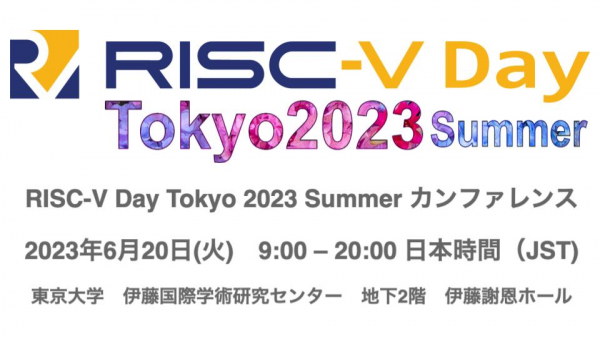
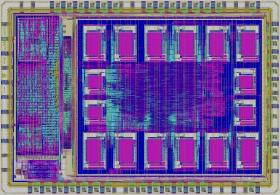

# リスクファイブのIPライセンスビジネス規模は、公開後8年で英アームに接近！　6月20日文京区本郷東大伊藤謝恩ホールで開催される「リスクファイブ　デイズ　東京　2023 サマー」のプログラム内容を公開。

2023年5月12日

  

本記事では、2023年4月13日にリリースしたプレスリリースによる予告、2023年4月24日のポスターセッション募集要項の公開に続き、2023年5月12日にプログラム内容を公開することをお知らせします。

「リスクファイヴデイ東京2023サマー」（RISC-V Day Tokyo 2023 Summer）は、RISC-V技術開発の多様な面を探求するための、日本最大のRISC-Vイベントであり、グローバルに、そして特に日本国内において、RISC-Vの影響力を広げるためのフレームワークであります。

背景説明

RISC-Vは、米国カリフォルニア大学バークレー校のKrste Asanovic教授が率いるチームにより、2010年に開発されたRISCプロセッサーの命令セットアーキテクチャ（ISA）です。英ArmのISAとは異なり、RISC-Vはオープン規格として設計されており、公開から10年以上が経過した現在でも、その採用は指数関数的に増加しています。

ここで注目すべきは、多くのIP企業が一つのRISC-V命令セットを採用し、共通のソフトウェアインフラストラクチャを使用してプロセッサを開発していることです。英Armは単一の企業と少数のパートナーとの間で、ハードウェアIPライセンスビジネス、ファブレスロジック半導体設計フロー、ソフトウェアインフラストラクチャの3つの領域を30年の長きにわたって構築してきました。これは間違いなく偉大な業績です。しかしながら、RISC-Vプロセッサを設計販売する20社以上のプロセッサIP企業やプロセッサチップ企業は、英Armが築き上げたこれらの仕組みを活用し、RISC-Vを支援する2000社以上の法人と協力して、たった8年で英Armの販売規模に迫る規模のビジネスをハードウェアIPライセンス分野やチップ分野で築き上げました。

現在、世界市場で流通している5Gモバイルのほぼ全数にRISC-Vが内蔵されています。また、新興企業がデータセンタAIアクセラレータ用のCPUにRISC-Vを採用し、既存企業もデータセンタAIアクセラレータチップに多数のRISC-V MCUを採用しています。アンドロイドは伝統的に英Armを基盤にしてきましたが、そのパラダイムも変わりつつあります。Google社が、RISC-Vベースのアンドロイドの開発を静かにサポートし始めたのです。

日本国内では、ルネサスエレクトロニクスがRISC-Vコアの採用を積極的に推し進めており、その結果、RISC-Vコアへの関心が急激に増しています。特に最近の数年間では、米中対立の背景にある中国がRISC-Vに強く興味を示し始め、その動きが明らかになっています。日本国内でRISC-Vが多用される一方、目立つ応用分野として電子タバコがあります。今回のプログラムでは、そのような応用分野を支えている企業も登壇します。Armはライセンス料に柔軟性がなく、低価格を売りにするフラッシュMCU分野では、RISC-Vマイコンが主流となる兆しを見せています。最近では、単価が25セントの32ビットRISC-Vフラッシュマイコンチップ製品も登場しています。

しかし、RISC-Vの受け入れは中国だけに留まらず、インドや韓国でも多く採用されているという事実は広く知られています。これらの国々は、新たな技術の採用に積極的であり、RISC-Vがその代表例となっています。

このように、RISC-Vはその開放性と柔軟性から、世界中の企業や研究者から広く支持を受けています。その結果、今や様々なデバイスやアプリケーションでRISC-Vが使われる時代が到来しています。その進化と普及の過程をRISC-V協会はこれからも見守り続けます。

今回のプログラムで特徴的なのは以下のことです。経済産業省では、半導体・デジタル産業戦略検討会議を定期的に開催しておりますが、その中の１つの議題として、

私たちは「リスクファイヴデイ東京2023サマー」（RISC-V Day Tokyo 2023 Summer）を開催できることを心から感謝します。昨年の「リスクファイヴデイズ東京2022オータム」に続き、再びこの舞台で皆様とともに、RISC-Vの最新の動向と先進的な研究成果を共有することを楽しみにしています。この会議は、国内最大規模のRISC-Vカンファレンスであり、RISC-Vのサプライヤーにとっては最高の技術PRと研究発表の場となっています。

AI、IoTをはじめとする各分野で、RISC-V関連の技術や製品が急速に進化し、その可能性が広がりつつあります。このカンファレンスは、それらの優れた技術や製品、そしてその背後にいるキーパーソンや技術者が一堂に会する絶好の機会を提供します。

リスクファイヴデイ東京2023サマーは、製品認知度の向上や企業間連携の実現、技術交流、情報収集といった活動を通じて、RISC-Vの生態系の発展を助けることを目指します。私たちは、各種業界の代表者が一堂に会し、互いに学び、共有し、新たなアイデアやビジョンを形成するこの機会を、皆様と共に迎えることを楽しみにしています。

これからの数ヶ月間、さらなる詳細が公開されるのをお待ちください。リスクファイヴデイ東京2023サマーは、RISC-Vコミュニティの発展と、その未来への一歩を共有するための素晴らしいプラットフォームとなることでしょう。

我が国の社会課題とRISC-Vの関わりについて

社会課題１：データセンターに起因する電力需要の爆発的増加の抑止:

経済産業省では、半導体・デジタル産業の環境変化について情報共有を行い、経済・社会の持続的成長を実現するための産業政策の方向性を探るため、半導体・デジタル産業戦略検討会議を定期的に開催しています。今年4月3日の会議で取り上げられた社会課題の一つとして、日本のデータセンターによる電力消費が全国の電力需要の4％を占めるという事実が挙げられました。これは、データセンターの電力消費が1％とされる米国と比較して、日本がデータセンターの電力需要比率が高い国の一つであることを示しています。
ムーアの法則（半導体の集積密度が18ヶ月から2年で倍増するが、トランジスターの増加に伴う性能向上が消費電力の増加を伴わない）が2015年に物理的な限界に達し、AIによる計算需要の増加にどのように対処するかが新たな社会課題となっています。

半導体の微細化に頼らずに電力消費を減らす方法として、アーキテクチャや方式、ソフトウェアを根本から見直すというアプローチが求められており、この課題に挑むスタートアップ企業が現れています。

AI計算に必要なソフトウェアインフラは、テンサー系数値演算ソフトウェアによって構築され、そのソフトウエアの規模は膨大で中味は複雑です。このようなソフトウェアを書き直す能力を持つ企業は、インテル、NVIDIA、Google、マイクロソフトなど、世界でもごく一部の超大企業であり、その開発には長い年月がかかります。

しかし、一部の人々は、既存のソフトウェアとハードウェアの維持だけではAI計算と電力需要とのバランスをとることが難しいと判断し、新たな改革を模索しています。その一部がRISC-Vを基盤としたスタートアップを形成し、資本家を説得して技術改革を進めようとしています。今回の「RISC-V Day Tokyo」では、こうした人々を招待し、彼らの視点と取り組みを共有する機会を設けています。我々は、彼らが提案する新たなアプローチが、AI計算の需要と電力消費の問題を解決する新たな道を切り開くことを期待しています。

社会課題2：国内の電子産業の国際競争力を強化するためのカスタム半導体の自社設計：

現在の電子産業のグローバルサプライチェーンでは、半導体のIP開発、チップ設計、製造、基板製造、システム統合、ソフトウェア統合などが、世界各国に分散して行われています。この中で、一部のサプライチェーンを担当する国々は、その特定の領域での専門知識と生産資本を蓄積し、サプライチェーンの一部が特定の国に固定化する傾向にあります。

その一方で、この国際的な分業体制の中で生じるルールの変化を早期に捉え、国内企業の国際競争力を維持・向上させるための研究と対応が必要です。RISC-V協会が注目している電子サプライチェーンにおけるゲームチェンジャーは、米国防総省のDARPAとGoogleなどの大手企業が推進する「オープンロードプロジェクト」です。これは、カスタム半導体を非常に低コストで開発することを可能にするプロジェクトで、新たなパラダイムを提示しています。

国内の零細企業でもカスタム半導体を設計試作製造することが早晩可能になると考えています。現在は、標準的な半導体、カスタムボード、ソフトウェア、そしてシステムなどのサプライチェーンなどしばしば海外に依存した技術で商品が開発されています。将来は、自社の技術を半導体やソフトウェアとして具体化することで、基本的なコストメリットを得る必要があると予想されます。新たな可能性を探し続ける国内企業にとっては、このようなプロジェクトやカスタム半導体の設計・製造は、成熟期の電子資本主義の中で隠された新しい機会を見つける手助けとなるはずです。そんな視点から、「RISC-V Day Tokyo」では、これらの挑戦をスタートアップや大企業として進めようとする企業の皆様を招待講演者としてお招きしました。

社会課題３：国内IoTシステムのセキュリティ強化とRISC-Vの役割：

2023年1月、国土交通省は不正アクセスの疑いから199台の河川監視カメラの運用を停止しました。その後の調査により、同じ事業者が設置したカメラも含め、合計で337台が停止されました。これらのカメラは、初期パスワードがそのままであったり、通信ポートのアクセス制限が設定されていないなど、セキュリティ運用上の不備が確認されたためです。停止されたカメラは、全国で約1万台の中の約5000台を占める「簡易型河川監視カメラ」の一部でした。また、異常な通信が確認された199台以外のカメラについては、不正アクセスがあったのか否かはまだ明らかにされていません。

米国では現代のIoTを守る公開鍵暗号に関する闘争が市民レベルでありました。1980年代と1990年代には、市民の権利としてプライベート暗号の使用を保護するために、民間の暗号科学者コミュニティが活動しました。これは、その後、インターネットやスマートフォンのプライバシー保護につながる成果を残すことになります。公開鍵暗号は米国においては市民権運動の闘争の一部であり、人文系の大学学部でも1年生から公開鍵暗号の概念や19世紀に提唱されたケルクホフスの原理を学ぶのが一般的です。しかし、日本では1990年代に一部の大企業が対称暗号を商品化するため公開鍵暗号を排除した歴史があり、国民基本台帳やパスポートなどの海外とのインターオペラビリティが重視される技術以外で公開鍵暗号が採用されることは少なかったようです。

その結果、日本ではIoTセキュリティに公開鍵暗号やルートオブトラスト機能が必要という認識が広まっていません。2010年代に韓国や米国のスマートフォンや多くのコンスーマ機器がルートオブトラスト機能を内蔵したのに対し、当初の日本のスマートフォンは十分な機能を内蔵していない事例もありました。

RISC-Vは、ルートオブトラスト機能が市場に登場した直後に誕生したため、セキュリティと自然に連携しています。そのため、多くのセキュリティチップの供給者がRISC-Vを採用しています。これにより、セキュリティ対策としてRISC-Vの重要性が高まってきています。

この流れを受けて、「RISC-V Day Tokyo」では、RISC-Vを活用したセキュリティ技術を持つ企業が何社かスポンサーとして参加します。これにより、RISC-Vとそれを活用したセキュリティ対策についての理解が深まるとともに、その普及に対する期待も高まるでしょう。

こうした動きは、日本のIoTセキュリティ強化のための重要なステップとなります。特に、公開鍵暗号やルートオブトラスト機能の必要性が認識されていない日本においては、新たな視点を提供し、セキュリティ対策の再検討を促す可能性があります。

結論として、RISC-Vは日本のIoTシステムのセキュリティ強化に大いに寄与できると言えます。それは、セキュリティ対策のあり方を見直し、新たな取り組みを始めるきっかけを提供するからです。これからの展開に大いに期待が寄せられます。

関連記事：https://xtech.nikkei.com/atcl/nxt/mag/nc/18/020600011/042800131/

講演者および内容について

予定されている講演者と講演内容は、主催者がつけた仮題です。提供されている時間はあくまで暫定的なものであり、詳細な発表情報については、適切な時期に、公式ウェブサイト「https://riscv.or.jp/risc-v-day-tokyo-2023-summer/」をご覧ください。敬称は省略させていただきます。

開始-終了 発表時間 | トピック | 講演者
8:30-8:50 20分 | 登録＆ウェルカムコーヒー | 主催者
8:50-9:00 10分 開会の挨拶 RISC-V協会
9:00-9:25 25分 | オープニング：日本のデジタル産業戦略と半導体ファブ | 齋藤尚史 | 商務情報政策局　情報産業課課長補佐（技術担当）（予定）
9:25-10:05 40分 | 基調講演：AIとRISC-V技術の未来（招待講演） | Jim Keller | Tenstorrent（テンストレント）（米国）
10:05-10:30 25分 | TBD | TBD
10:30-11:00 30分 | 交流＆コーヒーブレイク | RISC-V協会
11:00-11:25 25分 | RISC-Vセキュリティ：ハードウェアベースのソリューション | Andes Technology（アンデス・テクノロジー）（台湾）
11:25-11:50 25分 | ChipIgniteプログラム：8歳の子供でもFPGA設計をチップ化できる（招待講演）| Mohamed Kassem | CTO, eFabless.com
11:50-12:15 25分 | GigaDeviceのRISC-Vフラッシュマイコン製品と開発ツールについて | GigaDevice（ギガデバイス）（中国）
12:15-12:55 40分 | Codasipが提供するソフトウエアとハードウエア両方をカバーするカスタムRISC-Vソリューション | Codasip（コダシップ）（チェコ）
12:55-13:55 60分 | 昼休み（構内メトロ食堂、展示参観など）
13:55-14:35 40分 | RISC-Vの技術を基盤から支えるImperas のRISC-V設計支援ツール | Imperas（英国） / イーソルトリニティ（日本）
14:35-15:00 25分 | WiFi と ブルーツース と AIを RISC-Vで実現できるチップ | espressif（中国）
15:00-15:25 25分 | 日本初のArchiTekのRISC-VチップとAIシステムはすでに量産時期に | ArchiTek（日本）
15:25-15:50 25分 | NSITEXEのRISC-V製品とシステム製品の紹介 | NSITEXE（日本）
15:50-16:10 20分 | 交流＆コーヒーブレイク | RISC-V協会
16:10-16:35 25分 | IARシステムズからの高信頼性を実現するRISC-Vツールとセキュリティソリューション | IARシステムズ（スエーデン）
16:35-17:00 25分 | RISC-Vデバッグと完璧なトレースソリューション | 日本ローターバッハ（ドイツ）
17:00-17:25 25分 | イマジネーション・テクノロジーズのビジョンシステムソリューション | イマジネーション・テクノロジーズ（英）
17:25-17:55 30分 | 交流＆コーヒーブレイク | RISC-V協会
17:55-18:35 40分 | 基調講演：TBD | TBD
18:35-19:00 25分 | テンストレントデータセンターAIアクセラレータ現行世代、次世代 | David Bennet | Tenstorrent（テンストレント）（米国）
19:00-19:45 45分 | パネルディスカッション：内容は現在調整中 | モデレーター：TBD | RISC-V協会 パネリスト：Jim Keller, 経済産業省 他
19:45-19:55 10分 | 閉会の挨拶 | RISC-V協会
19:55-21:00 65分 | 交流＆お別れ会
注：TBDは”To Be Determined”の略で、まだ決まっていないという意味です。

1.行事名:
RISC-V Days Tokyo 2023 Summer
リスクファイブ　デイズ　東京　２０２３ サマー

2. 開催日時、方法:
6月20日（火） 8:30 ～ 21:00（日本時間）　完全会場方式

3. 参加登録サイト:　https://peatix.com/event/3553721

4. 会議情報サイト: https://riscv.or.jp/risc-v-day-tokyo-2023-summer/

5. SNS:
Web: https://riscv.or.jp/
Twitter: @riscv_a
Slack: https://risc-v-association.slack.com
Facebook: https://www.facebook.com/riscv.a

6. スポンサー（予定）
Codasip（チェコ）, テンストレント・ジャパン（米）, Imperas Software Ltd.（英国）/イーソルトリニティ（日本）
アンデス テクノロジー（米国）, espressif（中国）, ギガデバイス（中国）, NSITEXE（日本）, IARシステムズ（スエーーデン）,イマジネーション テクノロジーズ（英）, ArchiTek（日本）, DTSインサイト（日本）, 日本ローターバッハ（ドイツ）, 京都マイクロコンピュータ（日本）, ベリシリコン（中国）

7. 協賛
RISC-Vインターナショナル （RISC-V International :スイス）, 一般社団法人RISC-V協会（日本）, 一般社団法人　組込みシステム技術協会 RISC-V WG（日本）

8. 協賛内容：一般社団法人RISC-V協会会員によるカンファレンス開催のサポート

9. 主催及び運営：　SHコンサルティング株式会社

10. 事務所所在地、電話番号、郵便番号、担当者
〒104-0061　東京都中央区銀座7丁目18-13-502
河崎俊平　（代表）
齊藤康幸　（事務局）
電話: 03-5565-0556、E-mail: yasuyuki＜dot＞saito＜at＞riscv＜dot＞or＜dot＞jp

  
